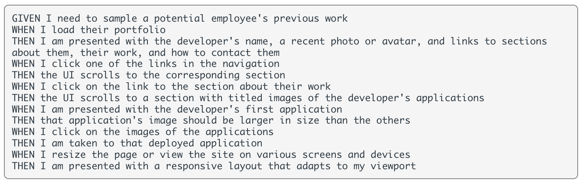

# Week-2-Portfolio

Week Two Challenge of the *UOB Full Stack Development Coding Bootcamp* requires students to develop a portfolio to showcase work samples.

We were given an Acceptance Criteria as per below:

Acceptance Criteria:

 

I approached this task by first creating a wireframe on Adobe InDesign to ensure that I am meeting the points as listed above, and to clearly map out what elements are required:

 

## Screenshot of Application:


* When the portfolio is loaded, you are presented a navigation bar at the top of the page with working links which scrolls to the different sections - About, Portfolio, Experience and Contact. 

* There is also a recent photo, name and a contact button which is linked to the Contact form. 

 
 


* In the Portfolio section, you are presented with a **Featured Project** and placeholders for **six** further projects. 

* The Featured *'Baxters'* Project image is also larger in size comparison to the other projects, and when clicked, will take you to the deployed application. 

 

* The bottom of the page includes a Contact Form and a Footer allowing visitors to easily get in touch either by submitting a form, or through a social link i.e LinkedIn.  


## Using Media Queries to create a responsive layout:


```
@media screen and (max-width: 768px) {
    .container,
    .flex-item-2,
    #intro {
        flex-direction: column;
        display: block;
        text-align: center;
        margin: 0 auto;
        position: static;
    }
```

* It's also important to create a responsive layout that adapts to different viewports to improve the user experience and enhance interactions. Above is a section of my code in *style.css*. For viewports of 768px and under, the flex-direction changes to columns instead of rows.

## URL to Deployed Application:

#### Final note: 

*As always, any feedback for improvements would be appreciated* 😊


